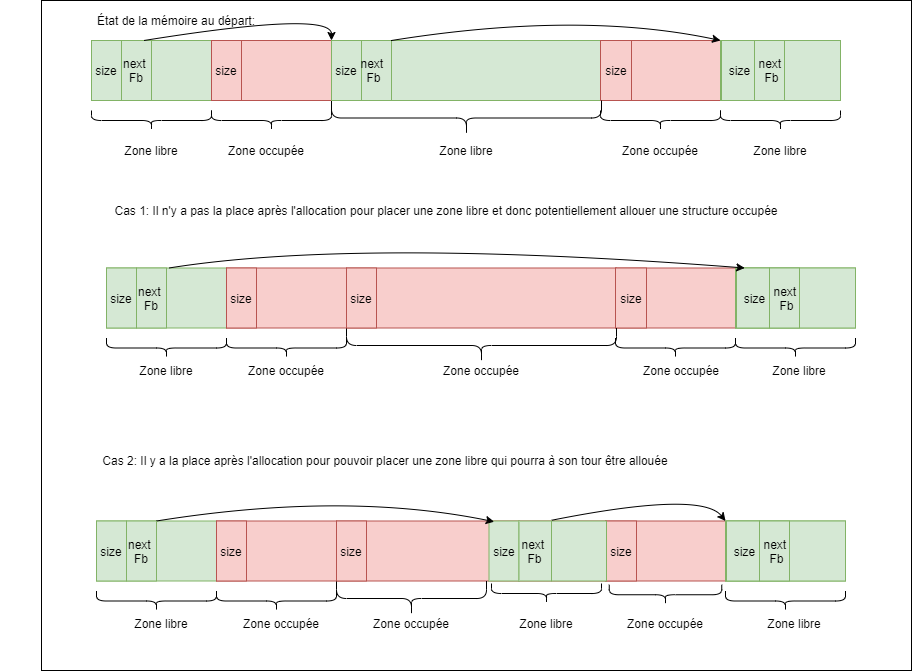

Ce package contient :
- un petit programme de test interactif de l'allocateur qui devra être implémenté dans mem.c : memshell
- un petit programme contenant un test simple de l'initialisation de l'allocateur qui devra être implémenté dans mem.c : test_init
- un Makefile vous permettant de compiler tout ces très gros programmes et de tester votre allocateur avec une appli réelle (make test_ls)
ATTENTION: sans implémentation correcte du début de l'allocateur, test_init boucle indéfiniment.

Fodor Gergely 
======================
Pelisse-Verdoux Cyprien         
=========================
__TP4 Allocateur mémoire__        
=========================

 ## Binôme U
 
 ### 18 décembre 2020                                    

---

- Pour ce TP, nous avons donc travaillé en duo afin de le réaliser. Vous trouverez en plus des éléments obligatoires différents schémas expliquant le fonctionnement de notre allocateur.

- L’allocateur fonctionne avec un système de bloc, libre ou occupé.
 > Un bloc est une zone de mémoire. Le bloc de base est le plus grand, il commence avec un header / un en-tête contenant la taille de la zone mémoire ainsi qu’un pointeur vers la première zone libre. Chaque zone libre est caractérisée par un en-tête précisant la taille de la zone ainsi que d’un pointeur pointant vers la zone libre. 

- Nous fournissons un fichier Makefile permetant de lancer nos test avec la commande: `make tests`
- La commande `make all` permet de compiler tout les fichiers ainsi que la bibliothèque *libmalloc.so*
- Pour supprimer les fichiers, la commande `make clean` est nécessaire

- En ce qui concerne la fonction *memAlloc*, nous avons choisi de créer les espaces mémoires au début des zones précédement libre. Deux choix dans l'allocation de mémoire sont à prendre en compte: 
    - Le cas où après l'allocation de mémoire il n'y a pas la place d'allouer une autre zone libre
    - Le cas où il y a possiblité après l'allocation d'allouer une zone libre

Le schéma ci desssous, nous montre comment cela ce passe: 
    

