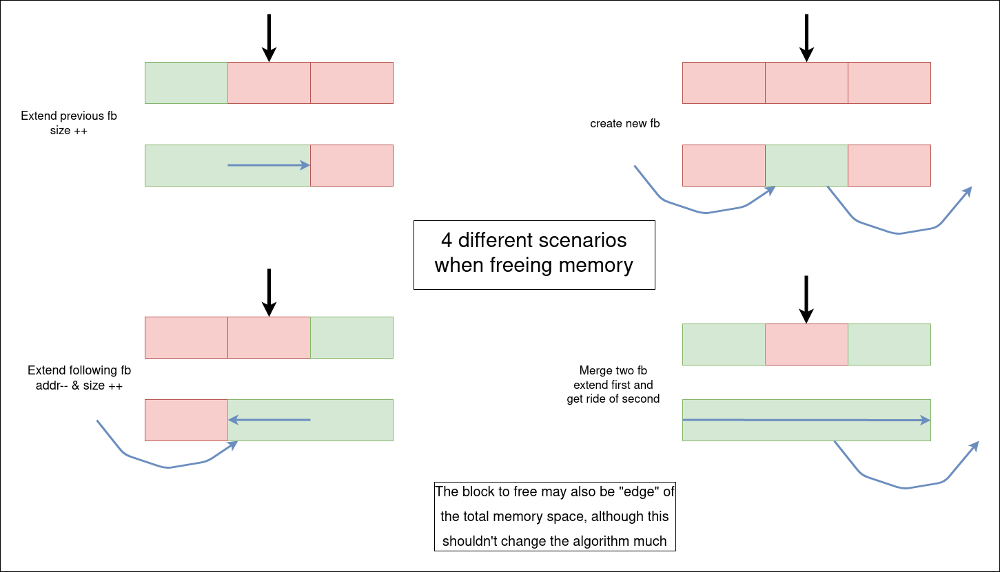

Ce package contient :
- un petit programme de test interactif de l'allocateur qui devra être implémenté dans mem.c : memshell
- un petit programme contenant un test simple de l'initialisation de l'allocateur qui devra être implémenté dans mem.c : test_init
- un Makefile vous permettant de compiler tout ces très gros programmes et de tester votre allocateur avec une appli réelle (make test_ls)
ATTENTION: sans implémentation correcte du début de l'allocateur, test_init boucle indéfiniment.

Fodor Gergely & Pelisse-Verdoux Cyprien  
========================
__TP4 Allocateur mémoire__        
=========================

## Binôme U
 
### 18 décembre 2020                                    

---

- Pour ce TP, nous avons donc travaillé en duo afin de le réaliser. Vous trouverez en plus des éléments obligatoires différents schémas expliquant le fonctionnement de notre allocateur, dans le fichier pictures.

- Nous fournissons un fichier Makefile permetant de lancer nos test avec la commande: `make`
- La commande `make all` permet de compiler tout les fichiers ainsi que la bibliothèque *libmalloc.so*.
- Pour supprimer les fichiers, la commande `make clean` est nécessaire.

- L’allocateur fonctionne avec un système de bloc, libre ou occupé.
 > Un bloc est une zone de mémoire. Le bloc de base est le plus grand, il commence avec un header / un en-tête contenant la taille de la zone mémoire ainsi qu’un pointeur vers la première zone libre. Chaque zone libre est caractérisée par un en-tête précisant la taille de la zone ainsi que d’un pointeur pointant vers la zone libre suivante ou null si elle n'existe pas. Les zones mémoires occupés sont caractérisés par leur taille, qui est la seul donnée de leur en-tête. 

- Le schéma ci-dessous montre comment est géré la mémoire par notre système. Cette representation bien sûr n'est pas figée, au fur et à mesure de l'allocation et de la libération des zones mémoires, les blocs changent d'adresse de tailles...

    

- La politique d'attribution de mémoire que nous avons utilisé est celle de **mem_fit_first**, en d'autres terme, la zone de mémoire choisi par la fonction pour être alloué est la première des zones qui correspond aux besoins d'allocations. L'allocation se fait alors avec *memAlloc* et la libération de la mémoire grâce à *memFree*. 

- En ce qui concerne la fonction *memAlloc*, nous avons choisi de créer les espaces mémoires au début des zones précédement libre. Deux choix dans l'allocation de mémoire sont à prendre en compte: 
    - Le cas où après l'allocation de mémoire il n'y a pas la place d'allouer une autre zone libre
    - Le cas où il y a possiblité après l'allocation d'allouer une zone libre
Dans cette fonction, on utilisera une fonction *get_previous* qui permet de récuperer le bloc libre qui point donc sur le bloc qui est passé en paramètre.

- Le schéma ci desssous, nous montre comment cela ce passe:

    

- En ce qui concerne notre implémentation de la fonction *memFree*, nous avons donc dû nous adapter à la fonction memAlloc et à sa façon d'allouer les blocks de mémoires. Plusieurs cas apparaissent comme le montre le schéma ci-dessous:

    

- Aucune extension n'a pu être codé ce qui implique une certaine faiblesse de notre code dans un usage régulier. En effet, la fonction *memFree* à un comportement non défini si une adresse non valable lui est donnée en paramètre. Il faut noter que c'est le même comportement que la fonction *free* de la bibliothèque *stdlib*. 

